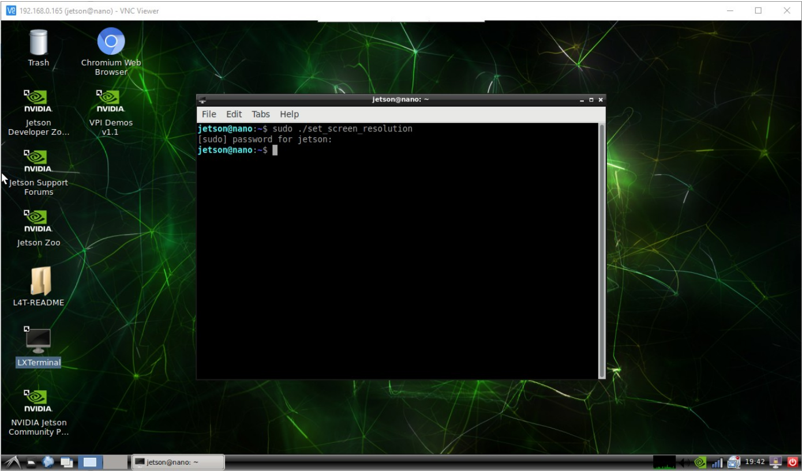
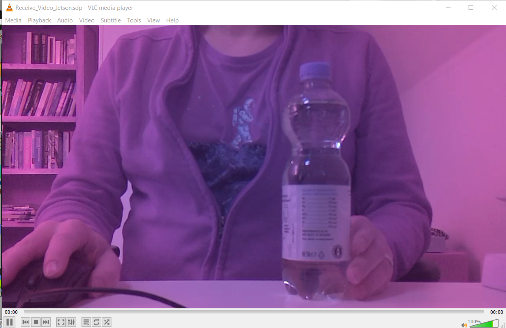
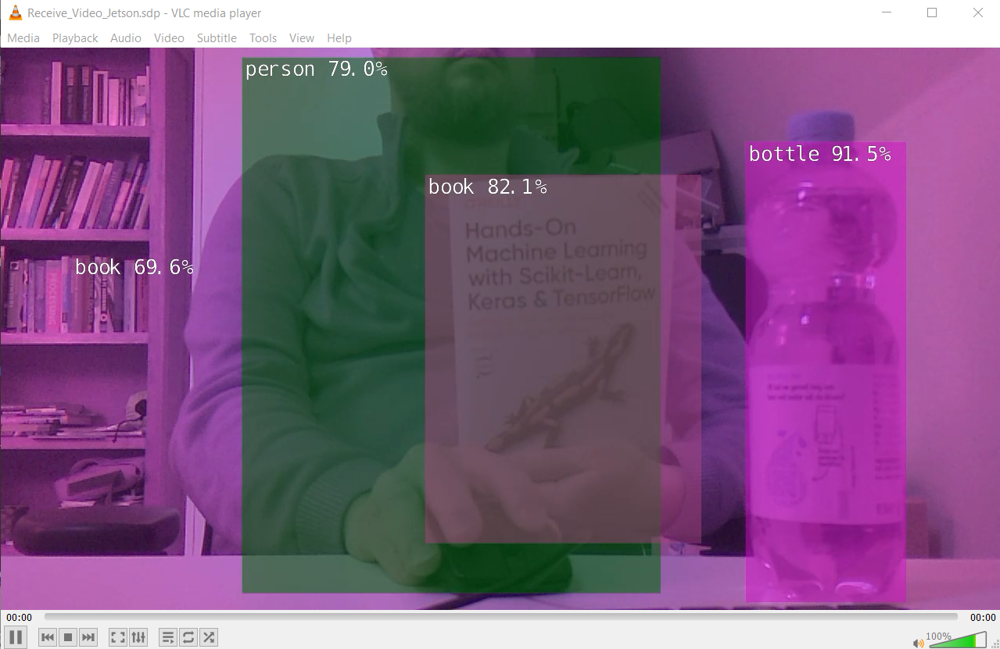

# Getting started with inference

Nvidia provided a lot of nice tutorials that show the deployment (inference) of pretrained models on the Jetson. Parts of these tutorials are needed for the assignment.
https://github.com/dusty-nv/jetson-inference

For this Assignment we are using **another docker image then we did before**, this docker image is already on your image and has everything already pre-installed for these tutorials, but you should know what it does, how to start it and how use it!

## Introduction docker image

This video shows an generic introduction to install the docker image and how to use it.
You can follow this example to get acquainted with this new image and to see how to setup and start camera's and inference networks.

> NOTE: Everything is already installed and downloaded for you (docker image and networks), so **you should skip the installation steps** as described.

https://www.youtube.com/watch?v=QXIwdsyK7Rw

The rest of this document will be a summary / clarification of this video

## Starting the docker

You can start the docker image as shown in the video, but we provided a launch script for the docker container that also mounts the Documents folder. To start the Docker:

`$ ./inference`

## Video Output

To be able to see the output of the camera and the results of the detection you have several options to display the output.

### Screen

You can connect an external screen and keyboard to the Jetson, and you run everything from the ubuntu Operating system.

### VNC viewer

You can login using VNC (as already described in the setup manual)

To fix the screen resolution to something more user friendly, open Putty and type: (as shown above)

`$ sudo ./set_screen_resolution`

### Streaming

You can also stream the video output directly from the network to your PC, this is also explained in the video above.
For this the [Realtime Transport Protocol](https://en.wikipedia.org/wiki/Real-time_Transport_Protocol) (rtp) is used.

rtp is enabled by this option:`rtp://<remote-ip>:1234`
To enable this you pass this as a parameter when launching the network.   

On the PC side you can receive the rtp stream using [VLC player](https://www.videolan.org/vlc/index.html).
To receive the stream on the pc you should launch VLC player with [this startup script](Data/Receive_Video_Jetson.zip)

> NOTE: You should start VLC after you launched the video stream on the host.

> NOTE: You can only stream video's, so if you start a program like `camera-capture` in the assignment you can only access it when you gave a GUI, so with a screen or over VNC.

## Camera

We provided you with a raspberry pi type Camera and a camera mount. You should install and test it. You can also use a USB camera if you want.

> NOTE: There is no Infra Red filter on this camera, which means it is suitable for low light conditions, but in normal conditions the output looks a bit Red.

If you want you can download another camera profile, that romoves some of the red haze, to do this you should run thse commands in the standard jetson image (so before you start the docker_
Download the profile
> `wget https://www.dropbox.com/s/u80hr1o8n9hqeaj/camera_overrides.isp`
Copy the profile to the correct location and make it executable
`sudo cp camera_overrides.isp /var/nvidia/nvcam/settings/`
`sudo chmod 664 /var/nvidia/nvcam/settings/camera_overrides.isp`
`sudo chown root:root /var/nvidia/nvcam/settings/camera_overrides.isp`

This is how you address the camera:

Raspberry pi camera
`csi://0`

USB camera
`/dev/video0`

### Test the camera and output

So to launch a test video with the RPi camera when connected to a screen or over VNC:

`$ video-viewer csi://0`

Launch the RPi camera and send it over rtp to the PC where the IP address is the IP address of the target PC:

` $ video-viewer csi://0 rtp://192.168.0.119:1234`

Use the provided script to start VLC on your PC.

See the [this github page ](
https://github.com/dusty-nv/jetson-inference/blob/9b66fbf38dcd0e81f37eb3748db3df0a221b4fa7/docs/aux-streaming.md) for more details if needed.

## Starting an inference networks

As in the tutorial video you can launch now an inference network and look at the output.

To start detectnet using the RPI camera

`$ detectnet csi://0`

Detectnet is able to run different pre-trained network architectures. To run detectnet on the RPI camera using the ssd-mobilenet-v2 and stream the result over rtp:

`detectnet --network=ssd-mobilenet-v2 csi://0 rtp://192.168.0.119:1234`

> NOTE: that when you run a new network architecture for the first time it does some optimization first

> NOTE: Not all possible architectures are pre-installed to save space on the SD card.

